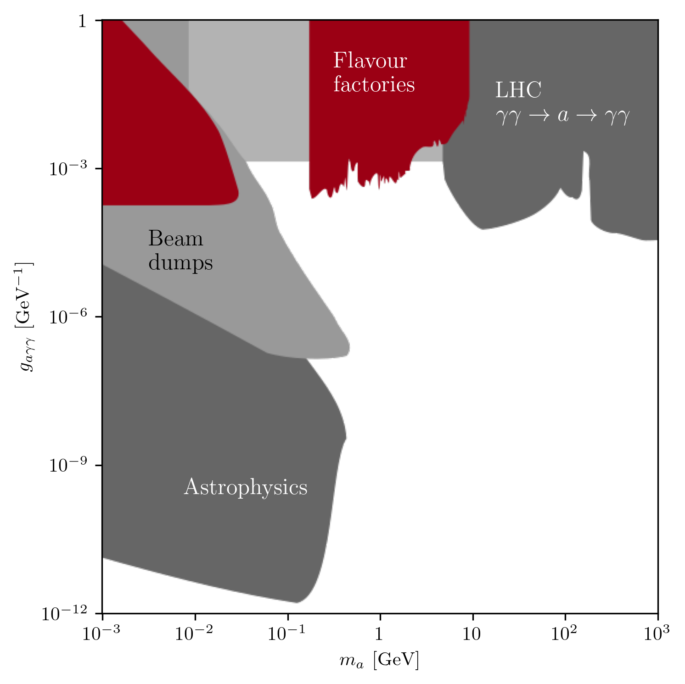
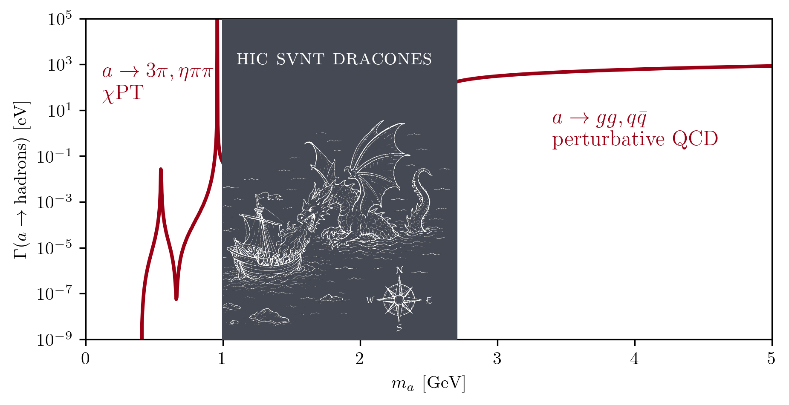
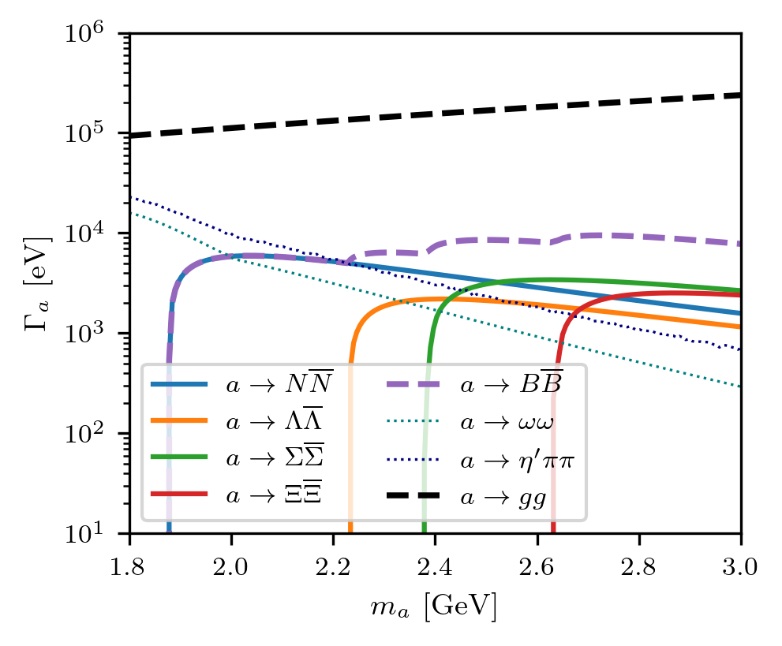
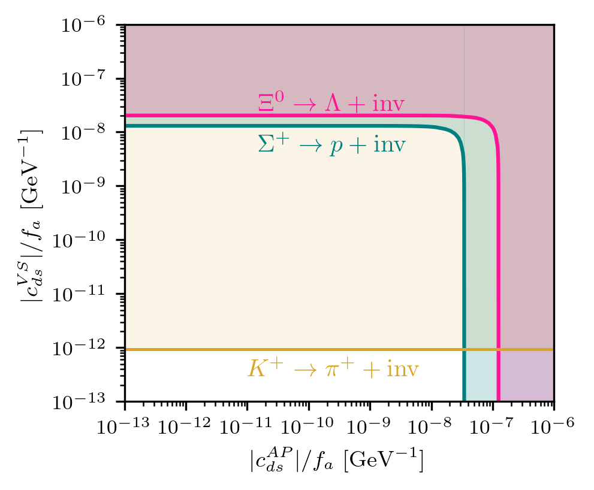
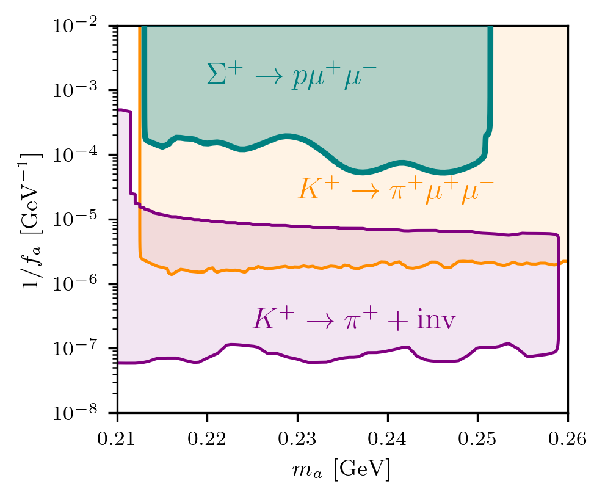
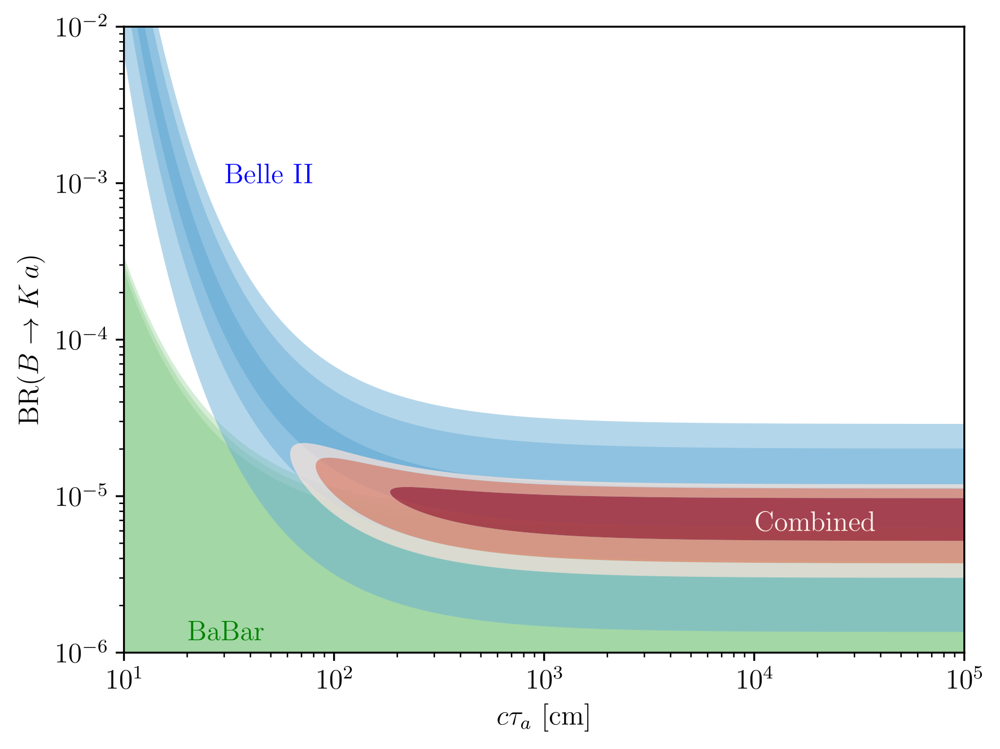
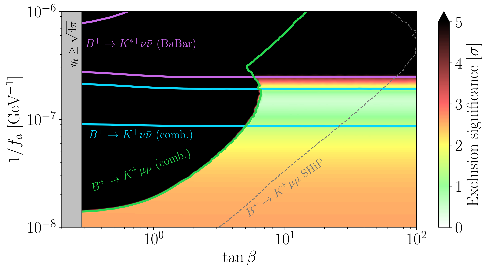
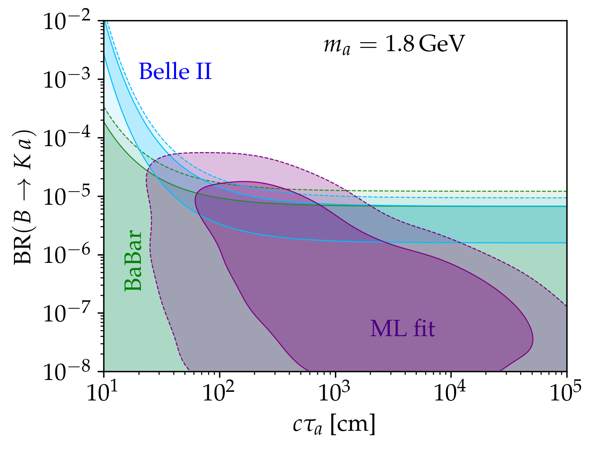

**Title:** GeV ALP interactions with hadrons

**Author:** Jorge Alda ([Università di Padova](https://www.dfa.unipd.it/) & [INFN Sezione di Padova](https://www.pd.infn.it/) & [CAPA Zaragoza](https://capa.unizar.es/)). View my [iNSPIRE-HEP](https://inspirehep.net/authors/1754154) and [ORCiD](https://orcid.org/0000-0002-6728-1105) profiles

**Date:** 10-14 August 2026

**Venue:** [Invisibles 26](https://indico.cern.ch/event/1561367/). A Coruña, Spain

## Why GeV?

Axion-Like Particles (ALPs) are pseudoscalars that arise as pseudo-Nambu Goldstone boson of some global $U(1)_\mathrm{PQ}$ spontaneously broken symmetry at scale $f_a$. The defining characteristic is that they do not follow the relation $m_a f_a \approx m_\pi f_\pi$ of the QCD axion. Despite not solving the strong CP problem (or at least not generally), they are interesting as Dark Matter candidates, as generic predictions of string theory and many other UV-complete models, and solutions to the flavour puzzle and the neutrino mass origin.

Given that their mass is a free parameter, a large theoretical and experimental programme is devoted to explore the whole "ALPscape", spanning from $m_a = 10^{-22}\,\mathrm{eV}$ to $m_a = 1\,\mathrm{TeV}$. For an overview, visit [Ciaran O'Hare's AxionLimits](https://cajohare.github.io/AxionLimits/). So it is fair to ask, what makes the region around $m_a = 1\,\mathrm{GeV}$ interesting to us?

<figure markdown="span">
{ width="70%" }
</figure>

The first reason is that the bounds in this region of the ALPscape are relatively weak. Especially if we compare to ALPs that are a bit lighter, $m_a \lesssim 200\,\mathrm{MeV}$, where astrophysical observables, like supernovae, impose extremely tight constraints. Also for heavier ALPs, $m_a \gtrsim 10\,\mathrm{GeV}$, the light-by-light scattering $\gamma \gamma \to a \to \gamma \gamma$ measured in ultraperipheal collisions at LHC provide excellent constraints. To us, this is a sign that we have still much work to do in the GeV region! (and who knows, maybe the ALP is hiding in plain sight at relatively low $f_a$).

A second reason is that this is the range of masses where the flavour structure of the ALP couplings is most relevant.

- All the fermions (except top quark) are dynamical degrees of freedom. In the case of lighter ALPs, fermions can be integrated out, and there is only experimental sensitivity to gluon and photon couplings.
- ALPs can kinematically be produced in hadron decays, and can decay into hadrons or leptons. This allows to probe flavourful couplings both in production and decay. In contrast, light ALPs can only decay to photons (or escape the detector before decaying), and heavier ALPs can only be produced in unflavoured processes.
- The dominant decay modes are to leptons and hadrons. The decay widths of these modes grow as $m_a$, while the gluonic modes grow as $m_a^3$ and become dominant for heavier ALPs.

As such, an observation of a GeV ALP in several channels would be ideal to pin down the UV structure of the interactions.

The next reason lies in the main players looking for GeV ALPs: LHCb and the flavour factories Belle II and BESIII. These experiments are able to reconstruct displaced secondary vertex. In the case of a long-lived ALP, they could tell apart its production and decay interaction points and measure their proper lifetime, which would constitute an independent observable together with the mass and various production and decay fractions. For example, LHCb has recently improved their track reconstruction algorithm and can now reconstruct downstream tracks that do not originate in the VELO, allowing for much longer-lived particles to be observed.

And the final reason is that there are still theoretical challenges in our understanding of the interactions between GeV ALPs and hadrons. This is not just an anecdotical issue affecting a few production and decay modes. Since hadronic modes represent in general a $\mathcal{O}(0.1-1)$ branching fraction, they are fundamental to properly compute the ALP decay length. And this length will determine if the ALP decays promptly, with a displaced vertex, or even outside the detector. Without knowing the hadronic interactions, we don't even know if some experiment can detect an ALP!

<figure markdown="span">
{ width="70%" }
</figure>

ALP interactions with hadrons have been studied mainly in two frameworks: In Chiral Perturbation Theory ($\chi$PT), where the physical degrees of freedom are the pseudoscalar mesons, acting as pseudo-Nambu Goldstone bosons of the spontaneously broken (for massless quarks) chiral symmetry, which is valid up to $\lesssim 1\,\mathrm{GeV}$. And in perturbative QCD (pQCD), starting from $\gtrsim 3\,\mathrm{GeV}$, the inclusive decay rate into hadrons can be approximated, exploiting the quark-hadron duality, by the decay rates into partons. This leaves an intermediate region where neither theory is valid.

As a possible way out, it has been proposed to extend the validity range of $\chi$PT by adding two new ingredients:

- Interactions with heavier hadrons, like vector, axial-vector, scalar and tensor mesons.
- Energy-dependent hadronic form factors. At intermediate energies, these form factors are data-driven leveraging information from decays of vector mesons. And at higher energies, they are chosen to reproduce the asymptotic behaviour predicted by the Lepage-Brodsky scaling laws of pQCD.

## ALP interactions with baryons

!!! abstract "References"

    Jorge Alda, Stefano Rigolin: _ALP interactions with baryons_    
    Coming soon (arXiv:2609.xxxxx)

As mentioned before, the full knowledge of the GeV region of the ALPscape requires taking into account "exotic" hadrons such as axial-vector mesons and tensor mesons. But what about everyone's favourite hadrons, the proton and neutron? That's what we are going to find out!

First we have to go back to $\chi$PT. If we perform a ALP-dependent chiral rotation of the quark fields parametrized by arbitrary hermitian matrices $\kappa$ and $\delta$,  
$q_{L,R} \to g_{L,R} \,q_{L,R} \equiv
    \exp\left(\frac{i a}{f_a} (\delta \mp \kappa)\right) q_{L,R} \,,$  
has several effects on the $\chi$PT _Lagrangian_:  

- Shifting of the ALP-gluon coupling, $c_G \to c_G - \langle \kappa\rangle$
- Redefinition of the meson fields, and consequently, of the ALP-meson mixing.

As we learnt in QFT 101, the $S$-matrix and all amplitudes are invariant under arbitrary field redefinitions, and chiral rotations for any $\kappa$ and $\delta$ whatsoever are no exceptions. We can exploit this reparametrization invariance to find the basis of fields where it is easier to compute our observables.

Historically, this was first exploited in the context of a QCD axion, that is, $m_a \approx 0$ and only coupling to gluons. In this case, the simple prescription $\kappa = c_G m_q^{-1}/\langle m_q^{-1}\rangle$ has the twofold effect of removing completely the gluon coupling (substituing it by quark couplings) and of removing the mixing with $\pi^0$. When moving on to more generic ALPs, some authors simply retained this convention, despite the fact that it no longer eliminated the mixing with mesons. Other authors instead generalized it to $\langle \kappa \rangle = c_G$, which still removes the gluon coupling and retains the mixing with mesons.

Our proposal is instead to ditch the requirement of eliminating the gluon coupling. Indeed, the matching procedure for the $G\widetilde{G}$ into $\chi$PT by means of a term that reproduces the $U(1)_A$ anomaly was already found by Gasser and Leutwyler 40 years ago,

$\mathcal{L}_{U(1)_A}^{\chi\mathrm{PT}} = 2 \chi_t \bigg(\langle\log u\rangle + c_G \frac{i\,a}{f_a} \bigg)^2\,.$

We can then focus on choosing the chiral rotation that removes the mixing with mesons and makes the computation of amplitudes easier. If the couplings are flavour-conserving, the ALP can mix with $\pi^0$, $\eta$ and $\eta'$, and there are three free parameters, the diagonal elements of $\kappa$. So it is always possible, for any value of $m_a$ and ALP couplings, a rotation matrix that fully eliminates the mixing with mesons. And in the QCD-axion limit, that rotation matrix coincides with the traditional prescription. And if there are also flavour-violating couplings, the ALP can also mix with $K^0$ and $\overline{K}^0$, and we eliminate this mixing with the off-diagonal elements of $\kappa$ and $\delta$.

After the matching to $\chi$PT and the election of the idoneous chiral rotation, now it is easy to obtain the effective couplings of ALPs with the octet of baryons $\mathcal{B}$ (including protons and neutrons) just by reading them off the Baryon $\chi$PT Lagrangian:  
$\mathcal{L}_B = \langle \bar{{\mathcal{B}}} \gamma^\mu \, i {\nabla_\mu} {\mathcal{B}}\rangle +
  \frac{D_B}{2}\langle\bar{{\mathcal{B}}} \gamma^\mu \gamma_5\{{u_\mu}, {\mathcal{B}}\}\rangle +\frac{F_B}{2}\langle\bar{{\mathcal{B}}} \gamma^\mu \gamma_5[{u_\mu}, {\mathcal{B}}]\rangle +
  \frac{S_B}{2}\langle\bar{{\mathcal{B}}}\gamma^\mu\gamma_5{\mathcal{B}}\rangle\langle{u_\mu}\rangle \equiv \sum_{B_1, B_2} \frac{\partial_\mu a}{f_a} \overline{B}_1 \gamma_\mu (c_{B_1 B_2}^V + c_{B_1 B_2}^A \gamma_5)B_2 \,,$  
where the ALP and its couplings are impemented, in a chirally invariant way, inside the covariant derivative $\nabla_\mu$ and the vielbein $u_\mu$.

The decay width into a pair of baryons is given by  
$\Gamma(a \to B \overline{B}) = \frac{m_a m_B^2}{2\pi f_a^2}|c_{BB}^A|^2 \sqrt{1-\frac{4 m_B^2}{m_a^2}}\,.$

The sum of all of the exclusive channels must be compared to the pQCD prediction of the inclusive hadronic decay rate, $\Gamma(a\to\mathrm{hadrons})\approx\Gamma(a\to gg)+\sum_q\Gamma(a\to q\bar q)$:

<figure markdown="span">
{ width="70%" }
</figure>

In the case of a gluophilic ALP, decays into baryons typically represent 5% of the hadronic modes, and above 2.2 GeV become the dominant decay channel.

And if we consider flavour-violating ALP-quark couplings, there are new ALP production channels, like $\Sigma^+ \to p a$ and $\Xi^0 \to \Lambda a$. The experiment BESIII has studied the channels $\Sigma^+ \to p + \mathrm{inv}$ and $\Xi^0 \to \Lambda + \mathrm{inv}$, that we re-interpret as an ALP escaping the detector. These decay modes are the only constraints to the vector flavour-violating coupling $c_{ds}^V$, while the axial combination $c_{ds}^A$ is heavily constrainded by $K^+ \to \pi^+ + \mathrm{inv}$.

<figure markdown="span">
{ width="70%" }
</figure>

Th baryon decay $\Sigma^+ \to p \mu^+ \mu^-$ was first studied by the experiment HyperCP, obtaining an excess compatible with a particle decaying into muons with mass 214 MeV. More recently, it has been analyzed by LHCb, that didn't reprodcue the excess. In order to describe the $\Sigma^+ \to p \mu^+ \mu^-$ decay as an ALP-mediated process, we need different couplings: the flavour-violating couplings $c_{ds}^A$ and/or $c_{ds}^A$, and the muon coupling $c_{\mu\mu}^A$. The correlations between those couplings will be model-dependent: we analyze them in the QED-DFSZ model with $\tan\beta=1$, where all the tree-level couplings to fermions are universal, and the flavour-violating $c_{ds}^A - c_{ds}^V$ combination is generated by integrating out the top and $W^\pm$ contributions. While the bounds are not yet competitive with $K^+\to \pi^+\mu^+\mu^-$ or $K^+ \to \pi^+ + \mathrm{inv}$, this is a promising sign for the application of baryonic decays to obtain ALP constraints.

<figure markdown="span">
{ width="70%" }
</figure>

## ALP-aca, the ALP Automatic Computing Algorithm

!!! abstract "References"

    Jorge Alda, Marta Fuentes Zamoro, Luca Merlo, Xavier Ponce Díaz, Stefano Rigolin: _ALPaca, the ALP Automatic Computing Algorithm_    
    [arXiv:2508.08354 [hep-ph]](https://arxiv.org/abs/2508.08354)

    [https://github.com/alp-aca/alp-aca](https://github.com/alp-aca/alp-aca)

Given the complexity associated to ALP processes in the GeV range, we have created ALP-aca (the ALP Automatic Computing Algorithm), an open-source Python library for phenomenological ALP studies:

- Matching from UV-complete theories: DFSZ, KSVZ, flaxion models
- Running of RG evolution for ALP couplings
- Computation of
    - ALP production in $H_1 \to H_2 a$ (hadronic) and $V \to \gamma a$ (quarkonia)
    - ALP decays, including hadronic modes
    - Probability of prompt, displaced vertex or long-lived process
- Statistical $\chi^2$ analysis of more than 100 measurements
- Production of exclusion plots and bibliographical summaries

## ALPs for the $B^+\to K^+ + \mathrm{inv}$ excess at Belle II

!!! abstract "References"

    Jorge Alda, Marta Fuentes Zamoro, Luca Merlo, Xavier Ponce Díaz, Stefano Rigolin: _Comprehensive ALP Searches in Meson Decays_    
    [arXiv:2507.19578 [hep-ph]](https://arxiv.org/abs/2507.19578)

Belle II found a $2.8\,\sigma$ excess in the $B^+\to K^+ \nu \bar \nu$ branching fraction. The kinematics is compatible with a particle of mass $\sim 2\,\text{GeV}$ that does not decay inside the detector.

<figure markdown="span">
{ width="70%" }
</figure>

In generic ALP models with $m_a=2\,\text{GeV}$, it is difficult to simultaneously achieve long decay length and a significant contribution to $B^+\to K^+ a$. Typically, an ALP in this mass range decays predominantly to muons and/or hadrons, and these decays tend to be very prompt.

Using ALP-aca, we have found a possible solution based on "astrophobic ALP" UV models: the SM fermions are charged under the PQ symmetry with non-universal charges. The $c_{bs}$ couplings are obtained after integrating out the top quark, while decays into muons and hadrons are suppressed by the interplay between tree-level and one-loop effects.

$c_{u_R} = \cos\beta\,,\qquad c_{d_R}=c_{e_R} = \sin \beta\,,\qquad c_{q_L}^{33} = c_{\ell_L}^{33} = 1\,.$

<figure markdown="span">
{ width="70%" }
</figure>

## Machine Learning analysis

!!! abstract "References"

    Jorge Alda: _Lecture Notes on Machine Learning applications for global fits_    
    [arXiv:2604.07520 [hep-ph]](https://arxiv.org/abs/2604.07520)

    Jorge Alda, Jacobo Asorey, Alejandro Mir, Siannah Peñaranda: _Physically Consistent Parameter Inference: Transparent Machine Learning Emulation in High Energy Physics and Cosmology_    
    [arXiv:2607.12726 [hep-ph]](https://arxiv.org/abs/2607.12726)

<figure markdown="span">
{ width="70%" }
</figure>
